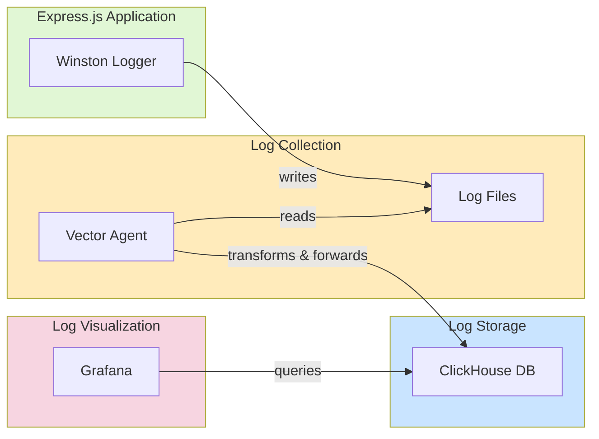

# Overwatch - Logging Infrastructure

A logging infrastructure setup using ClickHouse, Vector, and Grafana for efficient log aggregation, processing, and visualization.

## Project Structure
```
├── docker-compose.yml          # Main Docker Compose file
├── app/                        # Example Express.js app
│   ├── app.js                  # Main Express app
│   ├── logger.js               # Logger for the Express app
│   └── Dockerfile              # Dockerfile for the Express app
├── clickhouse/                 # ClickHouse configurations
│   ├── init.sql                # SQL script to create log tables
│   └── Dockerfile              # Custom ClickHouse image (if needed)
├── vector/                     # Vector configurations
│   └── vector.yaml             # Vector configuration
├── grafana/                    # Grafana configurations
│   ├── provisioning/           # Grafana provisioning configurations
│   └── dashboards/             # Grafana pre-configured dashboards
└── README.md                   # Project documentation
```

## Overview

This project implements a modern logging infrastructure using:
- **ClickHouse**: High-performance columnar database for log storage
- **Vector**: Data pipeline tool for collecting and transforming logs
- **Grafana**: Visualization and monitoring platform
- **Express.js**: Example application generating logs

## Architecture



## Prerequisites

- Docker
- Docker Compose
- Git

## Quick Start

1. Clone the repository:
```bash
git clone https://github.com/arifszn/overwatch.git
cd logging-infrastructure
cp .env.example .env
```

2. Start the infrastructure:
```bash
docker-compose up -d
```

3. Access the services:
- Grafana: http://localhost:3001 (credentials: admin/password)
- ClickHouse: localhost:8123 (HTTP) or localhost:9000 (native)
- Example App: http://localhost:3000

## Configuration

### Vector Configuration
Vector is configured to:
- Collect logs from the example application
- Transform and structure log data
- Forward processed logs to ClickHouse

Key configuration file: `vector/vector.yaml`

### ClickHouse Configuration
ClickHouse is set up with:
- Optimized table schema for log storage
- Proper indexing for efficient queries
- TTL policies for log retention

Initial setup script: `clickhouse/init.sql`

### Grafana Setup
Grafana comes pre-configured with:
- ClickHouse data source
- Sample dashboards for log visualization

## Deep Dive into Components

### ClickHouse

ClickHouse is an open-source columnar database management system designed for large-scale analytics and business intelligence workloads. It is known for its high performance in processing and querying vast amounts of data.

#### Protocol Support

ClickHouse supports multiple wire protocols, including MySQL and others, which allows clients that do not have native ClickHouse connectors to interact with it using the MySQL or other protocols.

#### Why is ClickHouse so fast?

ClickHouse achieves high performance through several optimizations:

- **Columnar Storage:** Stores data by columns rather than rows, which is efficient for analytical queries that aggregate data across many rows but fewer columns.
- **Vectorized Execution:** Processes data in batches, allowing for better CPU utilization and reduced overhead.
- **Native Compression:** Uses efficient compression algorithms that are optimized for both speed and space.
- **Asynchronous I/O and Multi-threading:** Allows for concurrent reading and processing of data.

#### Column-Oriented Database

A column-oriented database stores data by columns rather than by rows. This architecture is particularly advantageous for read-heavy workloads, such as analytics and reporting, where queries often aggregate data across many rows but only a few columns. By storing columns separately, the database can read and process only the necessary data, reducing I/O operations and improving query performance.

#### ClickHouse Engines

ClickHouse supports several engines, but the most commonly used are:

- **MergeTree:** The most universal and functional table engines for high-load tasks.
- **ReplacingMergeTree:** A variant of MergeTree that allows for deduplication of data.
- **Log:** Effective when you need to quickly write many small tables with a low latency.

##### Log Engine

- **Use Case:** Suitable for small datasets (<1 million rows), temporary or non-critical data, and simple setups with minimal configuration.
- **Features:** Limited features compared to MergeTree engines; lacks indexing, partitioning, and replication.

##### MergeTree Engine

- **Use Case:** Ideal for large datasets (millions or billions of rows), requiring high write throughput and efficient querying with advanced features like partitioning, indexing, compression, and TTL.
- **Scalability:** Supports horizontal scaling and replication for high availability.

##### Choosing the Right Engine

- For small, temporary datasets without complex requirements, the Log engine is sufficient.
- For larger datasets with performance and feature requirements, the MergeTree engine family is recommended.

We will be using the **MergeTree** engine for this project.

#### TTL in ClickHouse

Time-to-Live (TTL) policies in ClickHouse allow automatic deletion of data after a specified period. This is useful for managing log data retention, ensuring that old logs are automatically removed to save storage space and maintain performance.

```sql  
TTL toDateTime(Timestamp) + INTERVAL 30 DAY; -- Auto cleanup after 30 days
```

#### Docker Configuration

In the Docker setup, the `init.sql` script is mounted to `/docker-entrypoint-initdb.d/init.sql`. This is a standard practice in Dockerized ClickHouse setups. When the ClickHouse container starts, it executes any SQL scripts found in the `/docker-entrypoint-initdb.d/` directory, allowing for automatic initialization of the database schema and data.

#### Ports in ClickHouse

ClickHouse uses multiple ports for different protocols:

- **Port 9000:** Native ClickHouse protocol, optimized for performance.
- **Port 8123:** HTTP protocol, compatible with the MySQL protocol, making it accessible to a wider range of clients.

Using both ports provides flexibility in how clients connect to ClickHouse, balancing between performance and compatibility.

#### Schema-on-Write vs. Schema-less

ClickHouse is a schema-on-write database, meaning the schema is defined at the time of writing data. This approach allows for efficient storage and querying, as the database knows the structure of the data in advance. In contrast, schema-less databases like Cassandra offer more flexibility in data modeling but may sacrifice some performance and query efficiency.


### Vector

Vector is a data pipeline tool that collects, transforms, and routes logs, metrics, and traces. It is designed to be highly efficient, reliable, and easy to configure.

#### Key Features

- **Collect:** Vector can collect data from various sources, including files, sockets, and other data streams.
- **Transform:** It provides a wide range of transformations to structure and enrich log data, making it ready for analysis.
- **Forward:** Vector can forward processed data to various destinations, including ClickHouse, for storage and further processing.

#### Vector Configuration

Vector is configured to:
- Collect logs from the example application
- Transform and structure log data
- Forward processed logs to ClickHouse

Key configuration file: `vector/vector.yaml`

### Grafana

Grafana is an open-source platform for monitoring and observability. It allows users to visualize and explore time series data, set alerts, and create dashboards to monitor their systems and applications.

#### Setup

In this project, Grafana is pre-configured with:

- A ClickHouse data source, enabling it to query data stored in ClickHouse.
- Sample dashboards for log visualization, providing out-of-the-box visual representations of log data.

#### Customization

Users can customize Grafana further by adding more data sources, creating custom dashboards, and setting up advanced alerting rules based on their specific monitoring needs.

### Express.js Application

The Express.js application is a simple web application that generates log messages. It uses the `winston` logger to write logs to a file.

#### OpenTelemetry (OTel)

OpenTelemetry (OTel) is an open-source observability framework that provides a set of tools, APIs, and SDKs for collecting, processing, and exporting telemetry data (logs, metrics, and traces).

##### OpenTelemetry Schema

The OpenTelemetry schema refers to the standardized structure and format for telemetry data, including traces, metrics, and logs. This schema defines how data should be structured, what fields should be included, and how different types of telemetry data relate to each other.

For logs specifically, the OpenTelemetry log data model defines a standard set of fields and attributes that should be present in log records. This includes fields like timestamp, severity, body, attributes, and resource information. By adhering to this schema, different logging systems and tools can interchange log data in a standardized way, promoting interoperability and easing the integration between various components of a logging infrastructure.

##### Benefits of Using OpenTelemetry Schema

- **Standardization:** Ensures that your log data is consistent and can be easily understood and processed by different tools and systems that support the OTel schema.
- **Interoperability:** Tools and platforms that support the OpenTelemetry schema can seamlessly integrate with each other, allowing for a more unified approach to monitoring and observability.
- **Vendor Neutrality:** OpenTelemetry is vendor-neutral, meaning you're not locked into a specific vendor's ecosystem. This flexibility allows you to choose best-of-breed tools for different aspects of your monitoring stack.
- **Easier Onboarding:** Standardized schemas make it easier for new team members or stakeholders to understand and work with the logging infrastructure, as they can rely on well-defined structures and conventions.

##### Implementing OpenTelemetry Schema in Log Tables

When designing log tables in a database like ClickHouse, adhering to the OpenTelemetry schema can help ensure that the data is structured in a way that is compatible with a wide range of tools and platforms.

Here's an example of how you might structure a ClickHouse table to align with the OpenTelemetry log schema:

```sql
CREATE TABLE IF NOT EXISTS logs_otel
(
    Timestamp DateTime64(3),
    SeverityText String,  -- OpenTelemetry equivalent of log level
    SeverityNumber Int8,  -- Numeric representation of severity
    Body String,  -- Log message
    ServiceName String,  -- Service generating the log
    TraceId String,  -- OpenTelemetry Trace ID (if available)
    SpanId String,  -- OpenTelemetry Span ID (if available)
    ResourceAttributes String,  -- JSON string for resource-level attributes
    LogAttributes String  -- JSON string for structured log-specific attributes
)
ENGINE = MergeTree()
ORDER BY (Timestamp);
```

## Support

For support and questions:
- Create an issue in the repository
